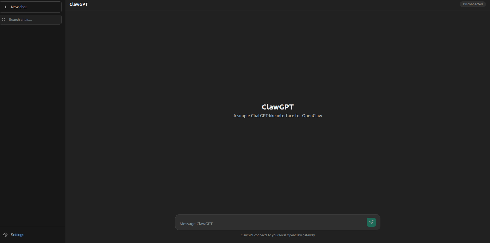

# ClawGPT

> **A free, self-hosted ChatGPT alternative** — Clean web interface for [OpenClaw](https://github.com/openclaw/openclaw)



**ClawGPT** gives you a familiar ChatGPT-like experience for your local AI. No cloud, no subscription, no data leaving your machine. Full ChatGPT-style editing, branching, and regeneration — the features power users actually want.

## ✨ Features

### Core Chat
- [x] **Chat history** — Saved locally via IndexedDB, never leaves your machine
- [x] **Multiple conversations** — Sidebar with all your chats
- [x] **Streaming responses** — See answers as they're generated in real-time
- [x] **Stop generation** — Red stop button to halt mid-response
- [x] **Dark/Light mode** — Easy on the eyes, system preference supported
- [x] **Mobile friendly** — Fully responsive design
- [x] **Zero dependencies** — No npm, no build tools, just HTML/CSS/JS

### Organization
- [x] **Pin favorite chats** — Drag-and-drop reordering, pinned chats stay at top
- [x] **Rename chats** — Custom titles instead of auto-generated ones
- [x] **Search chat history** — Find any conversation instantly with smart search
- [x] **Semantic search** — Optional AI-powered search for better results

### Editing & Branching
- [x] **Edit previous messages** — Modify any message in the conversation
- [x] **Chat branching** — Edits create branches, preserving original conversation
- [x] **Branch visualization** — Branches grouped under parent chats in sidebar
- [x] **Copy messages** — One-click copy for any message

### Response Control
- [x] **Regenerate responses** — Get a new answer with one click
- [x] **Model selection** — Choose different AI models per regeneration
- [x] **Per-chat model display** — See which model is being used

### Data & Storage
- [x] **IndexedDB storage** — Virtually unlimited local storage (no 5MB limit)
- [x] **Export chats** — Download all conversations as JSON backup
- [x] **Import chats** — Restore or merge chats from backup file
- [x] **Auto-migration** — Seamlessly migrates from localStorage if upgrading

## 🚀 Quick Start

### Step 1: Install OpenClaw

1. Install [Node.js](https://nodejs.org/) (LTS version)

2. Open a terminal and run:
   ```bash
   npm install -g openclaw
   openclaw wizard
   ```

3. When asked how to authenticate, choose **OAuth** to use your existing Claude.ai subscription (no extra cost!)

4. Start the gateway:
   ```bash
   openclaw gateway
   ```

You're now talking to Claude through OpenClaw. 

---

### Step 2: Set up ClawGPT

Just tell OpenClaw:

> **Set up ClawGPT for me: https://github.com/craihub/clawgpt**

That's it. OpenClaw will handle the rest.

---

### Manual setup (if you prefer)

<details>
<summary>Click to expand manual instructions</summary>

1. [⬇️ Download ClawGPT ZIP](https://github.com/craihub/clawgpt/archive/refs/heads/main.zip)

2. Extract to your **home folder** as `clawgpt`:
   - **Mac/Linux:** `~/clawgpt/`
   - **Windows:** `C:\Users\YourName\clawgpt\`

3. Start the web server (in the clawgpt folder):
   ```bash
   python3 -m http.server 8080
   ```

4. Open http://localhost:8080

5. The setup wizard will ask for your token. Ask OpenClaw:
   > *"What's my gateway token?"*

> 💡 **Can't find your home folder?** Ask OpenClaw: *"open my clawgpt folder"*

</details>

---

### For developers

```bash
git clone https://github.com/craihub/clawgpt.git ~/clawgpt
cd ~/clawgpt
python3 -m http.server 8080
```

## ⚙️ Configuration

Click the **Settings** button (gear icon) to configure:

| Setting | Description | Default |
|---------|-------------|---------|
| Gateway URL | OpenClaw WebSocket endpoint | `ws://localhost:18789` |
| Auth Token | Gateway authentication token | (from URL or manual) |
| Session Key | OpenClaw session to use | `main` |
| Dark Mode | Toggle dark/light theme | On |
| Smart Search | AI-generated summaries for search | On |
| Export/Import | Backup and restore all chats | — |

### Auto-Connect (Optional)

For multi-browser or incognito use, create a `config.js` file:

```bash
cp config.example.js config.js
# Edit config.js with your token
```

```javascript
window.CLAWGPT_CONFIG = {
  gatewayUrl: 'ws://localhost:18789',
  authToken: 'your-token-here',
  sessionKey: 'main'
};
```

Any browser opening ClawGPT will auto-connect using this config. The file is gitignored so your token won't be committed.

> ⚠️ **Security**: Only use config.js on localhost. If exposed to a network, anyone can view your token in the source.

## 🔧 How It Works

ClawGPT connects directly to OpenClaw's Gateway WebSocket API:

1. Establishes WebSocket connection to your local gateway
2. Authenticates with your token
3. Sends messages via `chat.send`
4. Receives streaming responses via `chat` events
5. Stores chat history in browser IndexedDB (with localStorage fallback)

**No server needed** — It's pure client-side JavaScript.

## 📁 Files

```
clawgpt/
├── index.html      # Main HTML structure
├── style.css       # ChatGPT-like styling
├── app.js          # WebSocket + UI logic + IndexedDB storage
├── screenshot.png  # UI screenshot
└── README.md
```

## 🔍 Why ClawGPT?

| | ChatGPT | ClawGPT |
|---|---------|---------|
| **Cost** | $20/month | Free (use your Claude.ai sub via OAuth) |
| **Privacy** | Data sent to OpenAI | Stays on your machine |
| **Internet** | Required | Works offline |
| **Model choice** | GPT-4 only | Any model via OpenClaw |
| **Edit messages** | ✅ | ✅ |
| **Branching** | ✅ | ✅ |
| **Regenerate** | ✅ | ✅ + model selection |
| **Search history** | ✅ | ✅ + semantic search |
| **Export/Import** | Limited | Full JSON backup |
| **Storage limit** | Cloud-based | Unlimited (IndexedDB) |
| **Data ownership** | OpenAI owns it | You own it |
| **Customization** | Limited | Full control |

## 🛠️ Troubleshooting

**Can't find the clawgpt folder?**
- Ask OpenClaw: *"open my clawgpt folder"* — it'll open the folder for you
- Default location: `~/clawgpt/` (home folder)

**Can't connect?**
- Make sure OpenClaw gateway is running (`openclaw gateway status`)
- Check the Gateway URL (default port is 18789)
- Verify your auth token — ask OpenClaw: *"what's my gateway token?"*

**Messages not sending?**
- Check browser console (F12) for errors
- Status should show "Connected" (green)

**Chat history missing?**
- Chats are stored in browser IndexedDB (per browser/profile)
- Use Settings → Export to back up your chats
- Use Settings → Import to restore from backup

**Moving to a new browser?**
1. In old browser: Settings → Export Chats
2. In new browser: Settings → Import Chats

## 🤝 Contributing

PRs welcome! Ideas for contribution:
- Keyboard shortcuts help panel
- Chat folders/tags
- Code syntax highlighting
- PWA/offline support

## 📄 License

MIT — do whatever you want with it.

---

## 🔑 Keywords

ChatGPT alternative, self-hosted AI chat, local LLM interface, OpenClaw UI, free ChatGPT, private AI assistant, open source ChatGPT clone, web UI for local AI, ChatGPT clone with branching, edit AI messages, regenerate AI responses, chat history search, self-hosted Claude interface, local GPT-4 UI, offline AI chat, conversation branching, edit and retry AI chat, free GPT interface, localhost AI chat, browser-based AI chat, no-signup AI chat, export chat history, import chat backup, IndexedDB chat storage, unlimited chat history, local AI web interface
